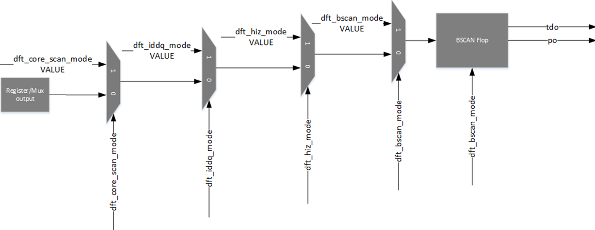

Advanced Features
=================
There are several features to gen_regs_py which either happen behind the scenes or may be needed in certain circumstances.

* DebugBus - An auto-generated set of registers that allows the user to 'probe' signals that implement the ``Mux Override`` bitfield type. Also creates an output port for debugging.
* DV Files - Files needed for DV or for designer testing
* NO_REG_TEST - Excludes this register from register testing
* DFT Features - Logic settings for various DFT modes

DebugBus
--------
``gen_regs_py`` will create two additional registers if any ``Mux Override`` bitfield types are instantiated in the register block:
* ``DEBUG_BUS_CTRL_SEL`` - Select signal for DEBUG_BUS_CTRL
* ``DEBUG_BUS_CTRL_STATUS`` - Status output for DEBUG_BUS_STATUS

A port ``debug_bus_ctrl_status`` is also created. This is essentially the output of the RO ``DEBUG_BUS_CTRL_STATUS`` register. The intent is that 
a user can connect this to an external debug bus (to GPIOs for example) and have a way to probe signals with a scope or inside the testbench.


A Mux structure will be created so that a user can select the RO register or '_muxed' output to observe. ``DEBUG_BUS_CTRL_SEL`` is used to select the signal, 
and ``DEBUG_BUS_CTRL_STATUS`` can be read to see the value of the signal.

``DEBUG_BUS_CTRL_SEL`` width is determined by the number of RO registers and muxed overrides. (e.g.2 seprate registers with RO bitfields and 7 muxed overrides 
would result in the bitfield being 4bits in width to handle 9 selections).

.. warning::
  Currently the debugbus would only support up to 2^32 overrides. If you need more than this, well, I don't know what to tell you, but you
  may want to re-evaluate what you are trying to do.

Each register with a RO bitfield or '_muxed' output is given it's own select value, and the position follows the following:
* Registers with RO bitfields are set first, going from lowest address to highest
* '_muxed' overrides are after and are based on the order in which they are declared in the file.

Here is an example of the DEBUG_BUS registers in the RTL:

.. code-block:: verilog
  :linenos:
  
  //---------------------------
  // DEBUG_BUS_CTRL
  // DEBUG_BUS_CTRL_SEL - Select signal for DEBUG_BUS_CTRL
  //---------------------------
  wire [31:0] DEBUG_BUS_CTRL_reg_read;
  reg [2:0]   reg_debug_bus_ctrl_sel;

  always @(posedge RegClk or posedge RegReset) begin
    if(RegReset) begin
      reg_debug_bus_ctrl_sel                 <= 3'h0;
    end else if(RegAddr == 'h50 && RegWrEn) begin
      reg_debug_bus_ctrl_sel                 <= RegWrData[2:0];
    end else begin
      reg_debug_bus_ctrl_sel                 <= reg_debug_bus_ctrl_sel;
    end
  end

  assign DEBUG_BUS_CTRL_reg_read = {29'h0,
          reg_debug_bus_ctrl_sel};

  //-----------------------
  assign swi_debug_bus_ctrl_sel = reg_debug_bus_ctrl_sel;


  //---------------------------
  // DEBUG_BUS_STATUS
  // DEBUG_BUS_CTRL_STATUS - Status output for DEBUG_BUS_STATUS
  //---------------------------
  wire [31:0] DEBUG_BUS_STATUS_reg_read;
  reg  [31:0]  debug_bus_ctrl_status;

  //Debug bus control logic  
  always @(*) begin
    case(swi_debug_bus_ctrl_sel)
      'd0 : debug_bus_ctrl_status = {swi_dac0_therm_lo_muxed};
      'd1 : debug_bus_ctrl_status = {1'd0, swi_dac0_therm_hi_muxed};
      'd2 : debug_bus_ctrl_status = {26'd0, swi_dac0_bin_muxed};
      'd3 : debug_bus_ctrl_status = {swi_dac1_therm_lo_muxed};
      'd4 : debug_bus_ctrl_status = {1'd0, swi_dac1_therm_hi_muxed};
      'd5 : debug_bus_ctrl_status = {26'd0, swi_dac1_bin_muxed};
      default : debug_bus_ctrl_status = 32'd0;
    endcase
  end 
  
  assign DEBUG_BUS_STATUS_reg_read = {          debug_bus_ctrl_status};

.. note ::
  
  The debug_bus is generally assumed to be a backup testing feature and/or an easy way to add those "just in case" type of status
  checks. It is not recommened to try to read the debug_bus in normal DV testing.


DV Files
--------
If a user passes the ``-dv`` flag, two additional files will be created:
* ``<prefix>_<block>_dv.txt`` - Used by ``gen_uvm_reg_model`` for UVM DV flows
* ``<prefix>_<block>_addr_defines.vh`` - Potentually used by DV and can be used for normal verilog simulations

.. note::
  Since ``<prefix>_<block>_dv.txt`` is technically an intermediate file, it will not be discussed here

``<prefix>_<block>_addr_defines.vh`` will create a list of Verilog ```defines`` that can be used for DV functions. Users will generally use
these defines for simple Verilog test benches to keep up with addresses/bitfield slices. Larger DV environments can continue to use these where
needed.

Registers
  Registers will be defined with the following format:
    ``<PREFIX>_<BLOCK>_<REGNAME>        <ADDRESS>``
  
Bitfields
  Bitfields will be defined with the following format (note the double underscore):
    ``<PREFIX>_<BLOCK>_<REGNAME>__<BFNAME>        <Bit select>`` 

Reset Value
  The Reset value will be defined with the following format (note the tripple underscore):
    ``<PREFIX>_<BLOCK>_<REGNAME>___POR        <Reset Value>`` 

Here is an example of the defines from the RFIFO example:

.. code-block:: verilog
  :linenos:
  
  `define RFIFO_EXAMPLE_REG1                                                     'h00000000
  `define RFIFO_EXAMPLE_REG1__BF1_MUX                                                     5
  `define RFIFO_EXAMPLE_REG1__BF1                                                       4:0
  `define RFIFO_EXAMPLE_REG1___POR                                             32'h00000000

  `define RFIFO_EXAMPLE_REG_WITH_RFIFO                                           'h00000004
  `define RFIFO_EXAMPLE_REG_WITH_RFIFO__READ_DATA                                       7:0
  `define RFIFO_EXAMPLE_REG_WITH_RFIFO___POR                                   32'h00000000

  `define RFIFO_EXAMPLE_DEBUG_BUS_CTRL                                           'h00000008
  `define RFIFO_EXAMPLE_DEBUG_BUS_CTRL__DEBUG_BUS_CTRL_SEL                                0
  `define RFIFO_EXAMPLE_DEBUG_BUS_CTRL___POR                                   32'h00000000

  `define RFIFO_EXAMPLE_DEBUG_BUS_STATUS                                         'h0000000C
  `define RFIFO_EXAMPLE_DEBUG_BUS_STATUS__DEBUG_BUS_CTRL_STATUS                        31:0
  `define RFIFO_EXAMPLE_DEBUG_BUS_STATUS___POR                                 32'h00000000


NO_REG_TEST
-----------
Occasionally there are registers in the design that are required to be excluded from normal register testing as they
may interfere with other logic. To work around this, ``NO_REG_TEST`` can be added to registers during declaration. This will
signal to ``gen_uvm_reg_model`` that this register should be added to the exclusion list. There is no effect on the 
RTL for declaring a register as ``NO_REG_TEST``.

To exclude a register, simply add ``{NO_REG_TEST}`` to the register declaration line, after the REGTYPE, but prior to the description 
(if there is a description). Below is an example:

.. code-block:: none
  :linenos:
  
  SPI0_CONTROLS                     RW      {NO_REG_TEST} 
    spi0_spi_en                     1'b1                  
    spi0_spi_master_en              1'b0   


DFT Features
------------
Since many designs will place registers driving vital components (analog, resets, etc.) into certain states during DFT, there may be cases where 
a user wants to have control over the output value during various DFT modes. To accomplish this without the need to extra external logic,
``gen_regs_py`` allows a user to denote the value of a bitfield during specific DFT modes, and optionally add a Boundary SCAN Drive/Capture flop.

DFT *Modes*
+++++++++++
Currently, ``gen_regs_py`` supports controls for the following DFT modes/settings:

* ``CORESCAN`` - DFT core scan mode for flop related testing (e.g. stuck-at)
* ``IDDQ`` - IDDQ Mode
* ``HIZ`` - Highz Mode
* ``BSCAN`` - Boundary Scan

.. note::
  These DFT *modes* are not required to be a one-to-one match. If you wanted to use IDDQ as some type of global power down setting,
  you are free to do that. The naming is meant to give users a match to typical DFT modes if they are required for their design.


Declaring Bitfield Values in DFT
++++++++++++++++++++++++++++++++
A user would declare a bitfield to have a DFT value by using the following syntax:

.. code-block:: none
  
  <BFNAME>       <BFRESET>    <BFTYPE> <{DFT}>  <DESCRIPTION>

The ``<{DFT}>`` portion of the bitfield declaration is actually expandable to allow a user to describe multiple DFT mode values. 

The main syntax for each mode would be as follows:

.. code-block:: none

  CORESCAN:<VAL>    - Value during core_scan mode
  IDDQ:<VAL>        - Value during iddq mode
  HIZ:<VAL>         - Value during highz mode
  BSCAN:<VAL>       - Value during bscan mode
  DFT:<VAL>         - Value during all DFT modes, unless explicity set
  BFLOP             - Instantiate a BSCAN Flop. If bitfield is RW then this is a drive flop
                      if bitfield is RO then this is capture flop

A special note about the ``DFT:<VAL>`` setting. This is used for cases where a user wants to say that any DFT mode not 
defined will have this value. It can be thought of as a "catch-all" for the DFT modes, and keep the input file simple.
However, if you define ``DFT:<VAL>`` with any other DFT mode setting, the explicity value will be used in the respective mode.

.. note::
  **Each instance is to be separated by a 'pipe' character, and all enclosed in curly brackets.** Example: ``{DFT:<VAL>|IDDQ:<VAL>}``

.. note::
  If declaring DFT modes for a bitfield that has a mux override, declare the DFT modes on the bitfield without the ``_mux``

.. warning::
  RO registers can **ONLY** have Boundary Scan Flops inserted as they drive no logic in the design. Any addtional DFT modes are ignored.


DFT Priority
++++++++++++
When declaring a bitfield for having DFT overrides, if more than one DFT mode is assigned, then the following priority
is used:

1. BFLOP - If a Boundary Scan Flop is instantiated, it is last in the DFT override chain
2. BSCAN 
3. HIZ
4. IDDQ
5. CORESCAN
6. Normal register operation


Below is an example of the circuit when all DFT modes are in effect.




.. note::
  Only modes that are supported for each bitfield will have a DFT mux override instantiated. For example, you have a a CORE_SCAN mode and a BFLOP
  set. You will only have the CORE_SCAN mux override and a final BFLOP.
  

  

RTL Generation
++++++++++++++
If no DFT modes are set for any of the bitfields, there are no additional ports on the top level Verilog. If DFT modes are set, the additional
ports are determined by modes needed for each bitfield.

This is a list of all the DFT related ports, and what would cause them to be instantiated:

.. code-block:: verilog
  :linenos:

  //DFT Ports (if used)
  input  wire dft_core_scan_mode,
  input  wire dft_iddq_mode,
  input  wire dft_hiz_mode,
  input  wire dft_bscan_mode,
  // BSCAN Shift Interface
  input  wire dft_bscan_tck,
  input  wire dft_bscan_trstn,
  input  wire dft_bscan_capture,
  input  wire dft_bscan_shift,
  input  wire dft_bscan_update,
  input  wire dft_bscan_tdi,
  output wire dft_bscan_tdo,     //Assigned to last in chain


* ``dft_core_scan_mode`` - If ``CORESCAN`` is used, OR if ``DFT`` is used
* ``dft_iddq_mode`` - If ``IDDQ`` is used, OR if ``DFT`` is used
* ``dft_hiz_mode`` - If ``HIZ`` is used, OR if ``DFT`` is used
* ``dft_bscan_mode`` - If ``BSCAN`` is used, if ``BFLOP`` is used, OR if ``DFT`` is used
* ``dft_bscan_* (shift interface)`` - If ``BFLOP`` is used


Internally the muxes that are used will follow a naming convention of ``clock_mux_<BFNAME>_<DFTMODE>``.
Any BFLOPS are given the name ``jtag_bsr_<BFNAME>``. Since bitfield names are required to be unique, there is
no concern of modules with the same name.


Examples
++++++++

DFT Mux Overrides
_______________________

While there are several combinations of valid descriptions, here are a few examples with respective comments
for what the user can expect:

.. code-block:: none
  :linenos:

  REG1                  RW     
    bf1                 4'h3        {DFT:0}         Global setting of 0 during DFT modes
    bf2                 5'b0        {HIZ:1}         Put DFT on the non-mux. Only active in Hiz mode
    bf2_mux             1'b0
    bf3                 1'b1        {IDDQ:0|DFT:1}  Set to 0 in IDDQ, but 1 in all other modes
    set_core_scan       1'b0        {CORESCAN:1}    Set to 1 in CORESCAN mode  
  

And this is what the RTL internals would look like:

.. code-block:: verilog
  :linenos:

  //---------------------------
  // REG1
  // bf1 - Global setting of 0 during DFT modes
  // bf2 - Put DFT on the non-mux. Only active in Hiz mode
  // bf2_mux - 
  // bf3 - Set to 0 in IDDQ, but 1 in all other modes
  // set_core_scan - Set to 1 in CORESCAN mode
  //---------------------------
  wire [31:0] REG1_reg_read;
  reg [3:0]   reg_bf1;
  reg  [4:0]   reg_bf2;
  reg         reg_bf3;
  reg         reg_set_core_scan;

  always @(posedge RegClk or posedge RegReset) begin
    if(RegReset) begin
      reg_bf1                                <= 4'h3;
      reg_bf2                                <= 5'h0;
      reg_bf2_mux                            <= 1'h0;
      reg_bf3                                <= 1'h1;
      reg_set_core_scan                      <= 1'h0;
    end else if(RegAddr == 'h0 && RegWrEn) begin
      reg_bf1                                <= RegWrData[3:0];
      reg_bf2                                <= RegWrData[8:4];
      reg_bf2_mux                            <= RegWrData[9];
      reg_bf3                                <= RegWrData[10];
      reg_set_core_scan                      <= RegWrData[11];
    end else begin
      reg_bf1                                <= reg_bf1;
      reg_bf2                                <= reg_bf2;
      reg_bf2_mux                            <= reg_bf2_mux;
      reg_bf3                                <= reg_bf3;
      reg_set_core_scan                      <= reg_set_core_scan;
    end
  end

  assign REG1_reg_read = {20'h0,
          reg_set_core_scan,
          reg_bf3,
          reg_bf2_mux,
          reg_bf2,
          reg_bf1};

  //-----------------------

  wire [3:0]  reg_bf1_core_scan_mode;
  wav_clock_mux #(.STDCELL(STDCELL)) u_wav_clock_mux_bf1_core_scan_mode[3:0] (
    .clk0    ( reg_bf1                            ),              
    .clk1    ( 4'd0                               ),              
    .sel     ( dft_core_scan_mode                 ),      
    .clk_out ( reg_bf1_core_scan_mode             )); 


  wire [3:0]  reg_bf1_iddq_mode;
  wav_clock_mux #(.STDCELL(STDCELL)) u_wav_clock_mux_bf1_iddq_mode[3:0] (
    .clk0    ( reg_bf1_core_scan_mode             ),              
    .clk1    ( 4'd0                               ),              
    .sel     ( dft_iddq_mode                      ),      
    .clk_out ( reg_bf1_iddq_mode                  )); 


  wire [3:0]  reg_bf1_hiz_mode;
  wav_clock_mux #(.STDCELL(STDCELL)) u_wav_clock_mux_bf1_hiz_mode[3:0] (
    .clk0    ( reg_bf1_iddq_mode                  ),              
    .clk1    ( 4'd0                               ),              
    .sel     ( dft_hiz_mode                       ),      
    .clk_out ( reg_bf1_hiz_mode                   )); 


  wire [3:0]  reg_bf1_bscan_mode;
  wav_clock_mux #(.STDCELL(STDCELL)) u_wav_clock_mux_bf1_bscan_mode[3:0] (
    .clk0    ( reg_bf1_hiz_mode                   ),              
    .clk1    ( 4'd0                               ),              
    .sel     ( dft_bscan_mode                     ),      
    .clk_out ( reg_bf1_bscan_mode                 )); 

  assign swi_bf1 = reg_bf1_bscan_mode;

  //-----------------------

  wire [4:0]  swi_bf2_muxed_pre;
  wav_clock_mux #(.STDCELL(STDCELL)) u_wav_clock_mux_bf2[4:0] (
    .clk0    ( bf2                                ),              
    .clk1    ( reg_bf2                            ),              
    .sel     ( reg_bf2_mux                        ),      
    .clk_out ( swi_bf2_muxed_pre                  )); 


  wire [4:0]  reg_bf2_hiz_mode;
  wav_clock_mux #(.STDCELL(STDCELL)) u_wav_clock_mux_bf2_hiz_mode[4:0] (
    .clk0    ( swi_bf2_muxed_pre                  ),              
    .clk1    ( 5'd1                               ),              
    .sel     ( dft_hiz_mode                       ),      
    .clk_out ( reg_bf2_hiz_mode                   )); 

  assign swi_bf2_muxed = reg_bf2_hiz_mode;

  //-----------------------
  //-----------------------

  wire        reg_bf3_core_scan_mode;
  wav_clock_mux #(.STDCELL(STDCELL)) u_wav_clock_mux_bf3_core_scan_mode (
    .clk0    ( reg_bf3                            ),              
    .clk1    ( 1'd1                               ),              
    .sel     ( dft_core_scan_mode                 ),      
    .clk_out ( reg_bf3_core_scan_mode             )); 


  wire        reg_bf3_iddq_mode;
  wav_clock_mux #(.STDCELL(STDCELL)) u_wav_clock_mux_bf3_iddq_mode (
    .clk0    ( reg_bf3_core_scan_mode             ),              
    .clk1    ( 1'd0                               ),              
    .sel     ( dft_iddq_mode                      ),      
    .clk_out ( reg_bf3_iddq_mode                  )); 


  wire        reg_bf3_hiz_mode;
  wav_clock_mux #(.STDCELL(STDCELL)) u_wav_clock_mux_bf3_hiz_mode (
    .clk0    ( reg_bf3_iddq_mode                  ),              
    .clk1    ( 1'd1                               ),              
    .sel     ( dft_hiz_mode                       ),      
    .clk_out ( reg_bf3_hiz_mode                   )); 


  wire        reg_bf3_bscan_mode;
  wav_clock_mux #(.STDCELL(STDCELL)) u_wav_clock_mux_bf3_bscan_mode (
    .clk0    ( reg_bf3_hiz_mode                   ),              
    .clk1    ( 1'd1                               ),              
    .sel     ( dft_bscan_mode                     ),      
    .clk_out ( reg_bf3_bscan_mode                 )); 

  assign swi_bf3 = reg_bf3_bscan_mode;

  //-----------------------

  wire        reg_set_core_scan_core_scan_mode;
  wav_clock_mux #(.STDCELL(STDCELL)) u_wav_clock_mux_set_core_scan_core_scan_mode (
    .clk0    ( reg_set_core_scan                  ),              
    .clk1    ( 1'd1                               ),              
    .sel     ( dft_core_scan_mode                 ),      
    .clk_out ( reg_set_core_scan_core_scan_mode     )); 

  assign swi_set_core_scan = reg_set_core_scan_core_scan_mode;


As you can see, ``bf1`` is set to be ``'d0`` in all DFT modes, so each DFT mux is instantiated with ``'d0``
as the value during the respective mode.

``bf2`` is only to be controlled in the ``HIZ`` mode, so only a mux override for ``HIZ`` mode is instantiated. Also note
that the mux overrides for DFT occur *after* the software controlled mux override.

``bf3`` is set to be ``'d0`` in ``IDDQ`` and ``'d1`` in all other modes. You can see that all modes have ``'d1`` except for
the ``IDDQ`` mux input.


Boundary Scan Stitching
_______________________


Here is an example of a user wanting to instantiate BFLOPs for several bitfields in the input file:

.. code-block:: none

  REG_WITH_BSCAN_FLOP   RW
    bscan_flop_drive    1'b0        {CORESCAN:1|BFLOP}          First in the chain since first in the file
    bscan_flop_capture  3'b0  RO    {BFLOP}                     2nd, 3rd, 4th in chain

  LAST_BSCAN_FLOP       RW
    last_one_in_chain   1'b0        {BFLOP}                     Last one in the chain


And here is the output Verilog:

.. code-block:: verilog
  :linenos:
  
  //---------------------------
  // REG_WITH_BSCAN_FLOP
  // bscan_flop_drive - First in the chain since first in the file
  // bscan_flop_capture - 2nd, 3rd, 4th in chain
  //---------------------------
  wire [31:0] REG_WITH_BSCAN_FLOP_reg_read;
  reg         reg_bscan_flop_drive;

  always @(posedge RegClk or posedge RegReset) begin
    if(RegReset) begin
      reg_bscan_flop_drive                   <= 1'h0;
    end else if(RegAddr == 'h4 && RegWrEn) begin
      reg_bscan_flop_drive                   <= RegWrData[0];
    end else begin
      reg_bscan_flop_drive                   <= reg_bscan_flop_drive;
    end
  end

  assign REG_WITH_BSCAN_FLOP_reg_read = {28'h0,
          bscan_flop_capture,
          reg_bscan_flop_drive};

  //-----------------------

  wire        reg_bscan_flop_drive_core_scan_mode;
  wav_clock_mux #(.STDCELL(STDCELL)) u_wav_clock_mux_bscan_flop_drive_core_scan_mode (
    .clk0    ( reg_bscan_flop_drive               ),              
    .clk1    ( 1'd1                               ),              
    .sel     ( dft_core_scan_mode                 ),      
    .clk_out ( reg_bscan_flop_drive_core_scan_mode     )); 

  wire  bscan_flop_drive_tdo;

  wire bscan_flop_drive_bscan_flop_po;
  wav_jtag_bsr u_wav_jtag_bsr_bscan_flop_drive (
    .i_tck         ( dft_bscan_tck                      ),          
    .i_trst_n      ( dft_bscan_trstn                    ),          
    .i_bsr_mode    ( dft_bscan_mode                     ),          
    .i_capture     ( dft_bscan_capture                  ),          
    .i_shift       ( dft_bscan_shift                    ),          
    .i_update      ( dft_bscan_update                   ),               
    .i_pi          ( reg_bscan_flop_drive_core_scan_mode     ),               
    .o_po          ( bscan_flop_drive_bscan_flop_po     ),               
    .i_tdi         ( dft_bscan_tdi                      ),                
    .o_tdo         ( bscan_flop_drive_tdo               )); 


  assign swi_bscan_flop_drive = bscan_flop_drive_bscan_flop_po;

  //-----------------------
  wire [2:0] bscan_flop_capture_tdo;

  wav_jtag_bsr u_wav_jtag_bsr_bscan_flop_capture[2:0] (
    .i_tck         ( dft_bscan_tck                      ),          
    .i_trst_n      ( dft_bscan_trstn                    ),          
    .i_bsr_mode    ( dft_bscan_mode                     ),          
    .i_capture     ( dft_bscan_capture                  ),          
    .i_shift       ( dft_bscan_shift                    ),          
    .i_update      ( dft_bscan_update                   ),               
    .i_pi          ( bscan_flop_capture                 ),               
    .o_po          ( /*noconn*/                         ),               
    .i_tdi         ( {bscan_flop_capture_tdo[1],
                      bscan_flop_capture_tdo[0],
                      bscan_flop_drive_tdo}     ),                
    .o_tdo         ( {bscan_flop_capture_tdo[2],
                      bscan_flop_capture_tdo[1],
                      bscan_flop_capture_tdo[0]}     )); 


  //---------------------------
  // LAST_BSCAN_FLOP
  // last_one_in_chain - Last one in the chain
  //---------------------------
  wire [31:0] LAST_BSCAN_FLOP_reg_read;
  reg         reg_last_one_in_chain;

  always @(posedge RegClk or posedge RegReset) begin
    if(RegReset) begin
      reg_last_one_in_chain                  <= 1'h0;
    end else if(RegAddr == 'h8 && RegWrEn) begin
      reg_last_one_in_chain                  <= RegWrData[0];
    end else begin
      reg_last_one_in_chain                  <= reg_last_one_in_chain;
    end
  end

  assign LAST_BSCAN_FLOP_reg_read = {31'h0,
          reg_last_one_in_chain};

  //-----------------------
  wire  last_one_in_chain_tdo;

  wire last_one_in_chain_bscan_flop_po;
  wav_jtag_bsr u_wav_jtag_bsr_last_one_in_chain (
    .i_tck         ( dft_bscan_tck                      ),          
    .i_trst_n      ( dft_bscan_trstn                    ),          
    .i_bsr_mode    ( dft_bscan_mode                     ),          
    .i_capture     ( dft_bscan_capture                  ),          
    .i_shift       ( dft_bscan_shift                    ),          
    .i_update      ( dft_bscan_update                   ),               
    .i_pi          ( reg_last_one_in_chain              ),               
    .o_po          ( last_one_in_chain_bscan_flop_po     ),               
    .i_tdi         ( bscan_flop_capture_tdo[2]          ),                
    .o_tdo         ( last_one_in_chain_tdo              )); 


  assign swi_last_one_in_chain = last_one_in_chain_bscan_flop_po;
  
  
  // ... excluded for clarity
  
  //=======================
  // Final BSCAN Connection
  //=======================
  assign dft_bscan_tdo = last_one_in_chain_tdo;
  

Since ``bscan_flop_drive`` is the first bitfield defined as a ``BFLOP``, it will be the first one in the chain. The user also
declared that this bitfield should be driven to a different value in ``CORESCAN`` mode, so a mux override for ``CORESCAN`` was placed
prior to the ``BFLOP``.

You can then see that bitfield ``bscan_flop_capture`` is next in the input file, so it is placed in the 2nd, 3rd, and 4th locations in
the chain (since it is multi-bit). You can see that ``gen_regs_py`` has automatically stitched these next flops in. The PO of the ``BFLOP``
is not connected for RO bitfields, as this is taken directly to the APB read interface.

The last bitfield ``last_one_in_chain`` is also defined as a ``BFLOP`` and is stitched in as the last location in the chain. Since it is the 
last one, it is connected to ``dft_bscan_tdo``, which is then connected to the next level of the design.

