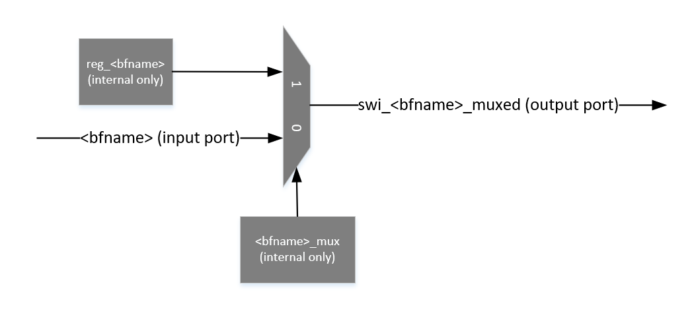

Register/Bitfield Types
=======================
``gen_regs_py`` supports the following register/bitfield types:

* RW - Read/Write 
* RW with Mux Override - A Read/Write register that can use the signal value from external design or be forced through a SW register
* RO - Read-Only
* W1C - Write-One-to-Clear
* WFIFO - Creates a FIFO Write Interface
* RFIFO - Creates a FIFO Read Interface

Most bitfield types will create one or more input/output ports with the name of the bitfield . 

RW (Read/Write) Bitfield
------------------------
A ``RW Bitfield`` is a typical bitfield which can be read and written via the APB interface. ``gen_regs_py`` will create
an output port named: 

* ``swi_<BFNAME> (output)`` - Writes to this bitfield will cause a transition on the output port.

Here is an example RW bitfield declaration:

.. code-block:: none
  :linenos:

  REG1                RW                      
    bf1               5'b0                    My read-write bitfield

Here is the Verilog output ports for this register block

.. code-block:: verilog
  :linenos:

  module rw_reg_example_regs_top #(
    parameter    ADDR_WIDTH = 8,
    parameter    STDCELL    = 1
  )(
    //REG1
    output wire [4:0]   swi_bf1,

    //DFT Ports (if used)

    // APB Interface
    input  wire RegReset,
    input  wire RegClk,
    input  wire PSEL,
    input  wire PENABLE,
    input  wire PWRITE,
    output wire PSLVERR,
    output wire PREADY,
    input  wire [(ADDR_WIDTH-1):0] PADDR,
    input  wire [31:0] PWDATA,
    output wire [31:0] PRDATA
  );

  // ...excluded for clarity
  
  //---------------------------
  // REG1
  // bf1 - My read-write bitfield
  //---------------------------
  wire [31:0] REG1_reg_read;
  reg [4:0]   reg_bf1;

  always @(posedge RegClk or posedge RegReset) begin
    if(RegReset) begin
      reg_bf1                                <= 5'h0;
    end else if(RegAddr == 'h0 && RegWrEn) begin
      reg_bf1                                <= RegWrData[4:0];
    end else begin
      reg_bf1                                <= reg_bf1;
    end
  end

  assign REG1_reg_read = {27'h0,
          reg_bf1};

  //-----------------------
  assign swi_bf1 = reg_bf1;

RW (Read/Write) Bitfield with Mux Override
------------------------------------------
This type of bitfield structure will create a register that can be used to "override" a particular signal.
This is often used in cases where you may be getting a signal from another block and want to have a way
to control that signal through software. For example, you have a calibration state machine that has an
`enable` signal which is set from some controller. During testing, you want to be able to control that enable
with software, but in normal usage want it to be controlled via the logic. This allows the user to take control
without the need to add any additional logic.

A user can describe this structure by defining a bitfield along with another bitifled with ``_mux`` appended to the
end of the name. This will trigger ``gen_regs_py`` to construct this type of structure.

``gen_regs_py`` will create two ports for this structure:

* ``<BFNAME> (input)`` - External logic connection.
* ``swi_<BFNAME>_muxed (output)`` - Result of the register/mux override.

Here is an example

.. code-block:: none
  :linenos:
 
  REG1                RW                      
    bf1               5'b0                    My read-write bitfield
    bf1_mux           1'b0                    Mux register select

And here is the Verilog output

.. code-block:: verilog
  :linenos:
  
  module rw_reg_mux_example_regs_top #(
    parameter    ADDR_WIDTH = 8,
    parameter    STDCELL    = 1
  )(
    //REG1
    input  wire [4:0]   bf1,
    output wire [4:0]   swi_bf1_muxed,

    //DFT Ports (if used)

    // APB Interface
    input  wire RegReset,
    input  wire RegClk,
    input  wire PSEL,
    input  wire PENABLE,
    input  wire PWRITE,
    output wire PSLVERR,
    output wire PREADY,
    input  wire [(ADDR_WIDTH-1):0] PADDR,
    input  wire [31:0] PWDATA,
    output wire [31:0] PRDATA
  );
  
  // ...excluded for clarity
  
  //Regs for Mux Override sel
  reg  reg_bf1_mux;

  //---------------------------
  // REG1
  // bf1 - My read-write bitfield
  // bf1_mux - Mux register select
  //---------------------------
  wire [31:0] REG1_reg_read;
  reg  [4:0]   reg_bf1;

  always @(posedge RegClk or posedge RegReset) begin
    if(RegReset) begin
      reg_bf1                                <= 5'h0;
      reg_bf1_mux                            <= 1'h0;
    end else if(RegAddr == 'h0 && RegWrEn) begin
      reg_bf1                                <= RegWrData[4:0];
      reg_bf1_mux                            <= RegWrData[5];
    end else begin
      reg_bf1                                <= reg_bf1;
      reg_bf1_mux                            <= reg_bf1_mux;
    end
  end

  assign REG1_reg_read = {26'h0,
          reg_bf1_mux,
          reg_bf1};

  //-----------------------

  wire [4:0]  swi_bf1_muxed_pre;
  wav_clock_mux #(.STDCELL(STDCELL)) u_wav_clock_mux_bf1[4:0] (
    .clk0    ( bf1                                ),              
    .clk1    ( reg_bf1                            ),              
    .sel     ( reg_bf1_mux                        ),      
    .clk_out ( swi_bf1_muxed_pre                  )); 

  assign swi_bf1_muxed = swi_bf1_muxed_pre;

  //-----------------------
  

As you can see, there is an input port named ``bf1`` and an output port named ``swi_bf1_muxed``. The input port would be the
signal from some external logic, where as the output port is overridden value.

.. note::
  The ``bitfield`` and ``bitfield_mux`` bitfields do not need to be in the same regsiter.
  

RO (Read-Only) Bitfield
-----------------------
A Read-Only bitfield is a bitfield which can only be read. When a RO bitfield is created, ``gen_regs_py`` will create
the following port:

* ``<BFNAME> (input)`` - Connection to observe logic

.. warning::
  RO bitfields are treated as asynchronous to ``gen_regs_py``. If you need SW to sample stable inputs, a demet or other external
  logic to the output register verilog is required.

W1C (Write-One-to-Clear) Bitfield
---------------------------------
A W1C bitfield is generally used in cases similar to interrupts (although not required). ``gen_regs_py`` will create the following:

* ``w1c_in_<BFNAME> (input)`` - Input from external logic
* ``w1c_out_<BFNAME> (output)`` - Output of the W1C bitfield, post rising edge detection
* A rising edge detection circuit

.. note::
  W1C bitfields are currently limited to single-bit width

Here is schematic representation of the W1C register logic

The input signal is sampled with a demet, then sent through a rising edge detection. On the rising edge the output register is set. The
register will remain in this state until a 1 is written.

Example of the waveform when the input signal sets the regsiter

Exmample of the waveform when the register is written to clear

Here is an example of declaring this bitfield

.. code-block:: none
  :linenos:
  
  REG1                RW                      
    bf1               5'b0                    My read-write bitfield
    bf1_mux           1'b0                    Mux register select

  REG_WITH_W1C        RW
    myinterrupt       1'b0      W1C           Using this like an interrupt

And here is the Verilog output

.. code-block:: verilog
  :linenos:
  
  module w1c_example_regs_top #(
    parameter    ADDR_WIDTH = 8,
    parameter    STDCELL    = 1
  )(
    //REG1
    input  wire [4:0]   bf1,
    output wire [4:0]   swi_bf1_muxed,
    //REG_WITH_W1C
    input  wire         w1c_in_myinterrupt,
    output wire         w1c_out_myinterrupt,

    //DFT Ports (if used)

    // APB Interface
    input  wire RegReset,
    input  wire RegClk,
    input  wire PSEL,
    input  wire PENABLE,
    input  wire PWRITE,
    output wire PSLVERR,
    output wire PREADY,
    input  wire [(ADDR_WIDTH-1):0] PADDR,
    input  wire [31:0] PWDATA,
    output wire [31:0] PRDATA
  );
  
  // ...excluded for clarity 

  //---------------------------
  // REG_WITH_W1C
  // myinterrupt - Using this like an interrupt
  //---------------------------
  wire [31:0] REG_WITH_W1C_reg_read;
  reg          reg_w1c_myinterrupt;
  wire         reg_w1c_in_myinterrupt_ff2;
  reg          reg_w1c_in_myinterrupt_ff3;

  // myinterrupt W1C Logic
  always @(posedge RegClk or posedge RegReset) begin
    if(RegReset) begin
      reg_w1c_myinterrupt        <= 1'h0;
      reg_w1c_in_myinterrupt_ff3 <= 1'h0;
    end else begin
      reg_w1c_myinterrupt        <= RegWrData[0] && reg_w1c_myinterrupt && 
                                    (RegAddr == 'h4) && RegWrEn ? 1'b0 : 
                                    (reg_w1c_in_myinterrupt_ff2 & ~reg_w1c_in_myinterrupt_ff3 ? 1'b1 : 
                                     reg_w1c_myinterrupt);
      reg_w1c_in_myinterrupt_ff3 <= reg_w1c_in_myinterrupt_ff2;
    end
  end

  demet_reset u_demet_reset_myinterrupt (
    .clk     ( RegClk                                     ),              
    .reset   ( RegReset                                   ),              
    .sig_in  ( w1c_in_myinterrupt                         ),            
    .sig_out ( reg_w1c_in_myinterrupt_ff2                 )); 

  assign REG_WITH_W1C_reg_read = {31'h0,
          reg_w1c_myinterrupt};

  //-----------------------
  assign w1c_out_myinterrupt = reg_w1c_myinterrupt;

.. note::
  To create an interrupt that is later sent out to an external IP (such as a CPU), a user can create the W1C bitfield and an associated RW bitfield
  to act as an enable:
  
  .. code-block:: none
    
    INTERRUPT_ENABLES          RW
      int_en_trans_complete    1'b1             0-trans_complete doesn't assert the interrupt out, 1-asserts

    INTERRUPT_STATUS           RO
      int_trans_complete       1'b0      W1C    Asserts when a transaction is compelte               
  
  And in the user logic, simply AND the output of the W1C with the interrupt enable to gate:
  
  .. code-block:: verilog
  
    assign interrupt_out = (swi_int_en_trans_complete       && w1c_out_int_trans_complete);

WFIFO Bitfield
---------------------------------
The WFIFO bitfield type is generally used in a case where you want to write to a specific address location that
results in a FIFO being written.

``gen_regs_py`` will create two ports for this bitfield type: 

* ``wfifo_<BFNAME>`` - The data written to the FIFO
* ``wfifo_winc_<BFNAME>`` - A write increment/valid signal to the FIFO 

.. note::
  There are actually no flops instantiated for this bitfield type. It is mainly a direct connection between the APB interface and the
  FIFO. For this reason, any reads to this bitfield will result in all zeros being read back.

.. warning::
  There is no FULL check added in the register block on the FIFO being written. A user should check FIFO state prior to writing the FIFO.

Eample input file:

.. code-block:: none
  :linenos:
  
  REG1                RW                      
    bf1               5'b0                    My read-write bitfield
    bf1_mux           1'b0                    Mux register select

  REG_WITH_WFIFO      RW
    write_data        8'b0      WFIFO         Writes to the FIFO

And an example of the Verilog output:

.. code-block:: verilog
  :linenos:
  
  module wfifo_example_regs_top #(
    parameter    ADDR_WIDTH = 8,
    parameter    STDCELL    = 1
  )(
    //REG1
    input  wire [4:0]   bf1,
    output wire [4:0]   swi_bf1_muxed,
    //REG_WITH_WFIFO
    output wire [7:0]   wfifo_write_data,
    output wire         wfifo_winc_write_data,

    //DFT Ports (if used)

    // APB Interface
    input  wire RegReset,
    input  wire RegClk,
    input  wire PSEL,
    input  wire PENABLE,
    input  wire PWRITE,
    output wire PSLVERR,
    output wire PREADY,
    input  wire [(ADDR_WIDTH-1):0] PADDR,
    input  wire [31:0] PWDATA,
    output wire [31:0] PRDATA
  );

  // ...excluded for clarity
  
  //---------------------------
  // REG_WITH_WFIFO
  // write_data - Writes to the FIFO
  //---------------------------
  wire [31:0] REG_WITH_WFIFO_reg_read;

  assign wfifo_write_data      = (RegAddr == 'h4 && RegWrEn) ? RegWrData[7:0] : 'd0;
  assign wfifo_winc_write_data = (RegAddr == 'h4 && RegWrEn);
  assign REG_WITH_WFIFO_reg_read = {24'h0,
          8'd0}; //Reserved

  //-----------------------

RFIFO Bitfield
---------------------------------
The RFIFO bitifled type is similar to the WFIFO, except that this is for reading from a FIFO.

``gen_regs_py`` will create two ports for this bitfield type: 

* ``rfifo_<BFNAME>`` - The data read from the FIFO
* ``rfifo_rinc_<BFNAME>`` - A read increment/valid signal to the FIFO 

.. note::
  There are actually no flops instantiated for this bitfield type. It is mainly a direct connection between the APB interface and the
  FIFO. Writes are essentially ignored for this bitfield.

.. warning::
  There is no EMPTY check added in the register block on the FIFO being read. A user should check FIFO state prior to reading the FIFO.

Eample input file:

.. code-block:: none
  :linenos:
  
  REG1                RW                      
    bf1               5'b0                    My read-write bitfield
    bf1_mux           1'b0                    Mux register select

  REG_WITH_RFIFO      RO
    read_data         8'b0      RFIFO         Reads from the FIFO

And an example of the Verilog output:

.. code-block:: verilog
  :linenos:
  
  module rfifo_example_regs_top #(
    parameter    ADDR_WIDTH = 8,
    parameter    STDCELL    = 1
  )(
    //REG1
    input  wire [4:0]   bf1,
    output wire [4:0]   swi_bf1_muxed,
    //REG_WITH_RFIFO
    input  wire [7:0]   rfifo_read_data,
    output wire         rfifo_rinc_read_data,

    //DFT Ports (if used)

    // APB Interface
    input  wire RegReset,
    input  wire RegClk,
    input  wire PSEL,
    input  wire PENABLE,
    input  wire PWRITE,
    output wire PSLVERR,
    output wire PREADY,
    input  wire [(ADDR_WIDTH-1):0] PADDR,
    input  wire [31:0] PWDATA,
    output wire [31:0] PRDATA
  );

  // ...excluded for clarity
  
  //---------------------------
  // REG_WITH_RFIFO
  // read_data - Reads from the FIFO
  //---------------------------
  wire [31:0] REG_WITH_RFIFO_reg_read;

  assign rfifo_rinc_read_data = (RegAddr == 'h4 && PENABLE && PSEL && ~(PWRITE || RegWrEn));
  assign REG_WITH_RFIFO_reg_read = {24'h0,
          rfifo_read_data};

  //-----------------------

