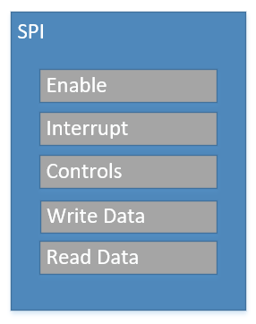
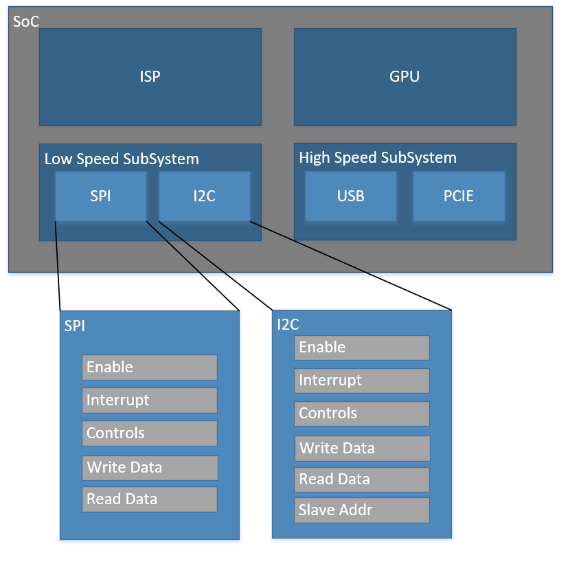

Methodology / Terms
===================

Generally for any SoC, there are a variety of IPs that are created and instantiated. Most, if not all of these IPs will have some level 
of registers which will be used to communicate or control the IP. Take for example a SPI IP with several registers:

While DVing this block at the IP level may seem trivial, once this IP is part of a larger subsystem the complexity can grow. There may be
multiple instances of this SPI IP. There may be other IPs with the same register/bitfield names. Testing and managing these registers 
can begin to be quite complicated. 

``gen_uvm_reg_model`` aims to help simplify this by allowing IP and subsystems to define BLK/SYS (block/system) files which they will use 
for DV at thier IP/subsystem level testing, and can be pulled in at the next level of hierarchy, even up to chip top. This allows an IP developer to 
clearly define register instances and addressing for the next level of integration.

``gen_reg_uvm_model`` uses the following terms when describing various register components:

.. code-block:: none
  
  System1
    --Register Block1
      --Register1
      --Register2
    --Register Block2
      --Register1
      --Register2  
      

Registers / Bitfields
  We will classify regsiters as a typical 32bit register which software can access. Each register is comprised of bitfields.

Register Block
  This is the level in which a set of registers has been described. *Usually* this is for registers which are created using ``gen_regs_py``, although
  any collection of regsiters is considered a ``Register block``

System / SubSystem / Register Subsystem
  This is a level in which one or more ``register blocks`` have been instantiated to form a ``System``.
  
Top Level
  This is the highest level of the register system. It is the DUT.

Taking the above image as an example, we would say the following:

* SPI is a ``Register Block`` with some registers ``Enable``, ``Interrupt``, etc.
* I2C is a ``Register Block`` with some registers ``Enable``, ``Interrupt``, etc.
* Low Speed Subsystem is a ``System`` with ``register blocks`` SPI and I2C.
* High Speed Subsystem is a ``System`` with ``register blocks`` USB and PCIE
* SoC is a ``System`` that includes the other ``Systems``, "Low Speed Subsystem" and "High Speed Subsystem", as well as two other Systems. In this case
  the SoC is the ``Top Level``.
  
Addressing
----------

``gen_uvm_reg_model`` works on the premise that all regsiter blocks have a base address of 0x0000. When a register block is instantiated in a design,
a designer would add in decode logic which would then "assign" an address to that group of registers. The block/system files, are a description of 
this addressing scheme. Because of this, it is generally recommended that designers either create this file or at least signoff on it's contents.

There will be checks to validate the reg_model vs. the design, which should flag any issues, however the initial setup needs to be completed with
an understanding of how the DUT has been architected.

.. tip::
  When a particular IP has been created with multiple register blocks and is instantiated at a higher level, the IP developer cannot be sure of the base
  address for their IP. Because of this, it is generally good design practice to create your block/system files with the start address beginning at 0x0000_0000
